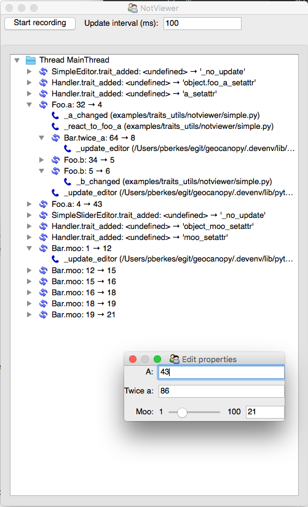
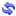

.. _notviewer:

NotViewer: The Traits Notification Viewer
=========================================

The Notviewer is a simple TraitsUI view for traits notifications. All
Traits change events, and the calls to notification handlers that they trigger,
are displayed in a tree view.

NotViewer requires Traits >= 4.6.0 .

Starting the NotViewer
----------------------

It's easy to add the NotViewer to an existing application for monitoring and
debugging traits notifications. Simply drop these commands in the appropriate
place::

    from apptools.traits_utils.not_viewer import NotViewer
    ui = NotViewer().configure_traits()

This will open a UI from which you can manually start recording the events.

Alternatively, you can programmatically start and stop the recording in your
script, and open the NotViewer with the result. ::

    not_viewer = NotViewer()
    not_viewer.start()
    # Your code here. All change events are recorded.
    not_viewer.stop()
    ui = not_viewer.configure_traits()

Using the NotViewer
-------------------

Here is a screenshot of the example script in
``apptools/examples/traits_utils/notviewer/simple.py``:

You can start recording notification events by clicking on the "Start
recording" button. While in recording mode, the NotViewer captures all change
notification events and updates the tree view of the events at regular
intervals, as specified in the "Update interval (ms)" text box. Stop the
notification events by clicking on the button again.

The tree view shows one root node per thread in your application. Below
each root, there will be two kind of nodes:

1) Change notification nodes display Traits change events, and are indicated
   by the icon |change-icon|. The text shows the name of the trait that has
   changed, the old value, and the new value.

2) Event handler nodes display calls to Traits notification handlers, and are
   indicated by the icon |call-icon|. The text shows the name of the function
   or method that has been called, and the file where it sits.

Calls to notification handlers can trigger more change events, and so the
tree can be nested for several layers.

.. |call-icon| image:: calling.png
